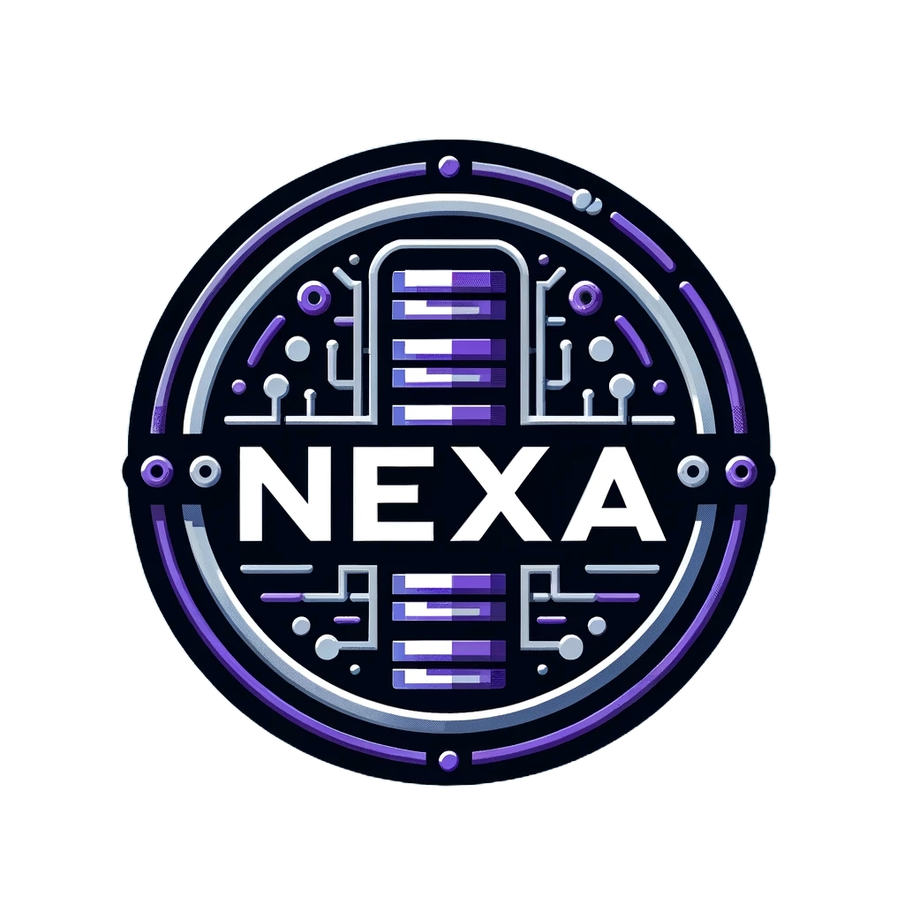

<!-- PROJECT LOGO -->
 

  

<h3 align="center">NexaDB</h3>

  

    A project for FBLA Website Coding & Development (2023 - 2024)
  

<!-- ABOUT THE PROJECT -->
## ❓ About The Project

NexaDB is a website for a database management company to help the company find applicants. The website includes an application form, a page with employee benefits and business information, a careers page, and a dashboard for the management to review applicants.

## 🏆 Program Awards
#4 NLC (Orlando, FL) 
#1 SLC (Green Bay, WI) 
#1 RLC (Columbus, WI)

## 👷 Built With

| Technology                                                                                                        | Description                               |
| ----------------------------------------------------------------------------------------------------------------- | ----------------------------------------- |
|[NextJS](https://nextjs.org/)|A React framework for building full-stack web applications |
|[MongoDB](https://nextjs.org/)|A non-relational document database that provides support for JSON-like storage|
|[Firebase](https://firebase.google.com/)|A backend database used for file storage.|

<!-- LICENSE -->
## 👨‍⚖️ License

Distributed under the MIT License. See `LICENSE.txt` for more information.

<!-- CONTACT -->
## ✉️ Contact

Kooper Propp - koopercodes@gmail.com 
Nolan Erickson - nwerickson09@gmail.com 
Project Link: [https://github.com/Kooperlol/nexadb](https://github.com/Kooperlol/nexadb)
