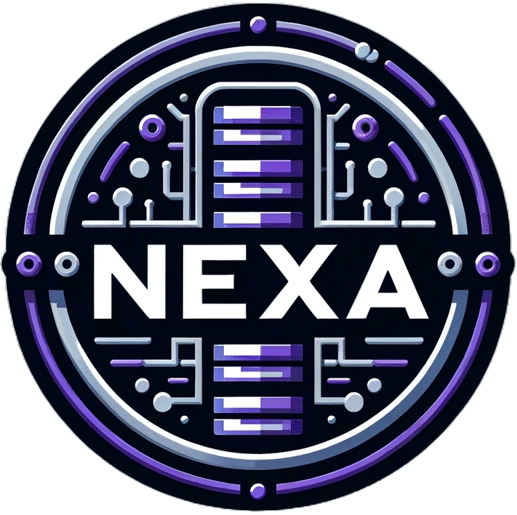

<!-- PROJECT LOGO -->
 

  

<h3 align="center">NexaDB</h3>

  

    A project for FBLA Website Coding & Development (2023 - 2024)
  

<!-- ABOUT THE PROJECT -->
## ❓ About The Project

Coming soon

## 🏆 Program Awards

tbd Wisconsin - Regionals 
tbd Wisconsin - State 
tbd Flordia - Nationals

## 📜 Requirements Met

Coming soon

## 👷 Built With

| Technology                                                                                                        | Description                               |
| ----------------------------------------------------------------------------------------------------------------- | ----------------------------------------- |
| [![Flutter][Flutter]](https://flutter.dev/)           | A framework that can compile to multiple operating systems from just one coding language.        |
| [![Firebase][Firebase]](https://firebase.google.com/) | A backend database used for authentication, file storage, and document storage.           |

<!-- DEPENDENCIES -->
## 💾 Dependencies

<!-- EXTERNAL RESOURCES -->
## 🔌 External Resources

* [Undraw](https://undraw.co/)
* [Pexels](https://www.pexels.com/)
* [Best Readme Template](https://github.com/othneildrew/Best-README-Template)
* [Github Image Shields](https://github.com/badges/shields)

<!-- COMPATIBILITY -->
## 📱 Compatibility

![IOS][IOS] 
![Android][Android]

<!-- GETTING STARTED -->
## 🔧 Getting Started

To get a local copy up and running follow these simple steps.

### 🧠 Prerequisites

Coming soon

### ⬇️ Installation

Coming soon

### 📑 Instructions

Coming soon

<!-- LICENSE -->
## 👨‍⚖️ License

Distributed under the MIT License. See `LICENSE.txt` for more information.

<!-- CONTACT -->
## ✉️ Contact

Kooper Propp - kooperjack8@gmail.com 
Nolan Erickson - add 
Project Link: [https://github.com/Kooperlol/nexadb](https://github.com/Kooperlol/nexadb)

<!-- MARKDOWN LINKS & IMAGES -->
[license-shield]: https://img.shields.io/github/license/othneildrew/Best-README-Template.svg?style=for-the-badge
[Flutter]: https://img.shields.io/badge/Flutter-%2302569B.svg?style=for-the-badge&logo=Flutter&logoColor=white
[Firebase]: https://img.shields.io/badge/Firebase-039BE5?style=for-the-badge&logo=Firebase&logoColor=white
[IOS]: https://img.shields.io/badge/iOS-000000?style=for-the-badge&logo=ios&logoColor=white
[Android]: https://img.shields.io/badge/Android-3DDC84?style=for-the-badge&logo=android&logoColor=white
